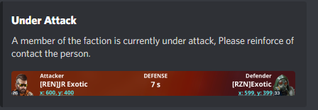

# Warning bot

a Discord Webhook that sends information if a member of the faction gets attacked by enemies!

## Setup

Install [python](https://www.python.org) and add it to [path](https://datatofish.com/add-python-to-windows-path/).

Open up main.py with notepad or some other editor

Locate the text that says ```your-webhook``` and paste in your discord webhook
Double Click ```setup.bat``` and allow it to finish.

To start the program use a program thats called [PYCharm](https://www.jetbrains.com/pycharm/) and run the ```main.py``` go into the Game and Press on Attack´s and just leave it there. If a maintenance happends the program will just run and it will not spam your discord!

## Preview

